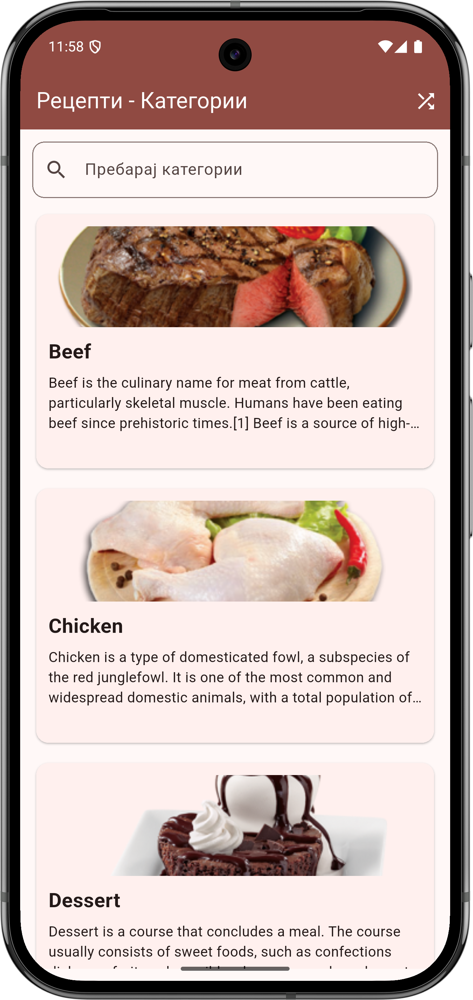
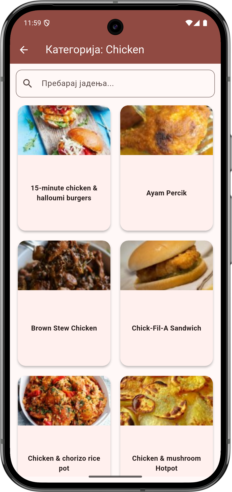
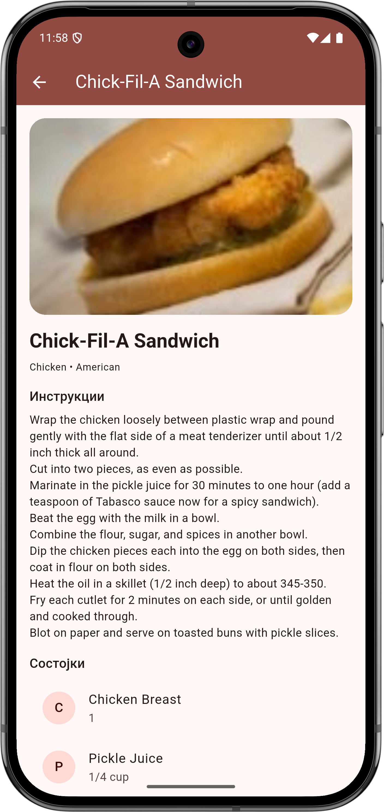

# Meals App

A modern Flutter mobile application that displays recipes from TheMealDB API, allowing users to browse categories, view meals, and see detailed recipe information including ingredients and YouTube tutorials.

## Features

* **Home Screen:** Shows a list of recipe categories using card widgets.

    * Each card displays: category name, image, and short description.
    * Search bar allows filtering categories by name.
    * Pull-to-refresh support to reload categories.
    * **Random Recipe Button:** Opens a randomly selected recipe directly from the AppBar.
* **Category Meals Screen:** Tap on a category card to see meals in that category.

    * Displays meals in a responsive grid layout with image and name.
    * Search bar filters meals locally by name.
    * Tap a meal to open detailed recipe.
* **Meal Details Screen:** Detailed view of a selected recipe.

    * Shows image, name, category, area, cooking instructions.
    * Ingredients displayed in a neat list with quantity measures.
    * Opens YouTube video tutorial if available.

## Screenshots

## Technologies

* **Flutter 3.35.7**
* **Dart**
* **Material Design 3**
* **http** package for API requests
* **url_launcher** package for opening YouTube links

## Getting Started

1. Clone the repository.
2. Run `flutter pub get` to install dependencies.
3. Launch the app using `flutter run` on your device or emulator.

## API

* Uses [TheMealDB API](https://www.themealdb.com/api.php) v1.
* Fetches categories, meals by category, meal details, search by name, and random meal.

---
